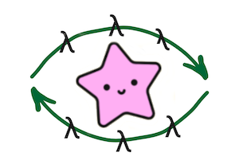

# functx

[](https://hex.pm/packages/functx)
[](https://hexdocs.pm/functx/)




Tiny Gleam caching Context for your functions

```sh
gleam add functx
```

```gleam
import functx.{type Ctx}

fn nums(ctx: Ctx(Int)) {
  // this function called only once during context

  let #(n, _) = ctx

  #([1, 2, 3, 4, 5, 6, 7, 8, 9, n], ctx)
}

fn nums_as_string(ctx) {
  use ns, ctx <- functx.call(ctx, nums)

  let resp =
    ns
    |> list.map(fn(n) { n |> int.to_string })
    |> string.join(",")

  #(resp, ctx)
}

fn nums_to_sum(ctx) {
  use ns, ctx <- functx.call(ctx, nums)

  let resp = {
    use acc, n <- list.fold(ns, 0)
    acc + n
  }

  #(resp, ctx)
}

fn nums_summary(ctx) {
  use ns_str, ctx <- functx.call(ctx, nums_as_string)
  use ns_sum, ctx <- functx.call(ctx, nums_to_sum)

  let resp = "Nums: " <> ns_str <> " Sum: " <> ns_sum |> int.to_string

  #(resp, ctx)
}

pub fn main() {
  let resp =
    10
    |> functx.make_ctx
    |> nums_summary

  resp.0 // Nums: 1,2,3,4,5,6,7,8,9,10 Sum: 55
}
```

Further documentation can be found at <https://hexdocs.pm/functx>.

## Development

```sh
gleam run   # Run the project
gleam test  # Run the tests
gleam shell # Run an Erlang shell
```

## See also

- [context-fp](https://github.com/darky/context-fp) - Functional programming context for TypeScript
- [context-fp-go](https://github.com/darky/context-fp-go) - Functional programming context for Golang
